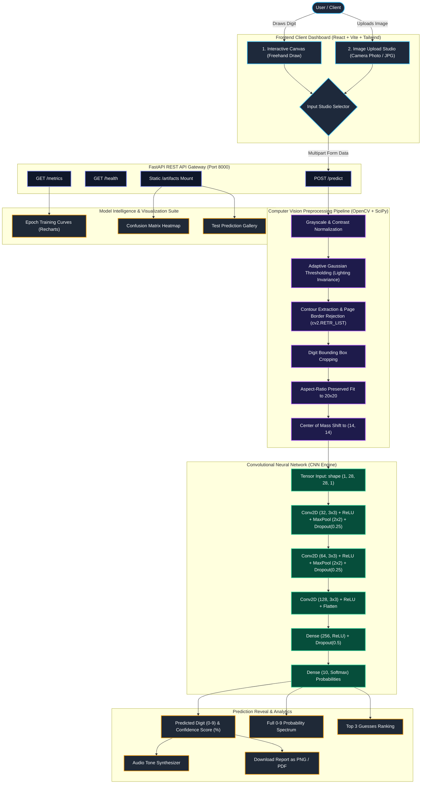

# AI Handwritten Digit Recognition System

Modern, end-to-end handwritten digit recognition system built with a **TensorFlow / Keras Convolutional Neural Network (CNN)** backend, a high-performance **FastAPI REST API**, and a modern **React + Vite + Tailwind CSS** dashboard.

Recognizes any handwritten digit (**0 to 9**) from freehand canvas sketches as well as real-world smartphone camera photos of paper documents with **98.78% test accuracy**.

---

## Architecture & Workflow Diagram



---

## Detailed Component Workflow & Functions

### 1. User Interaction & Input Studio ([`frontend/src/components/InputStudio.jsx`](file:///c:/Users/durai9999/OneDrive/Pictures/Desktop/digit-recognition-ai/frontend/src/components/InputStudio.jsx))
* **Drawing Canvas**:
  * 280×280 HTML5 Canvas supporting both mouse and high-precision touch/pen pointers.
  * Configurable brush thickness (`Normal: 18px`, `Thick: 26px`) with round cap smoothing.
  * **Live Predict Mode**: Debounced real-time prediction automatically fires upon stroke release.
  * **Quick Sample Presets**: Instant 1-click test buttons (`[2]`, `[7]`, `[8]`, `[3]`, `[0]`) to test handwritten shapes immediately without manual drawing.
* **Upload Studio**:
  * Drag-and-drop zone supporting JPG, PNG, and BMP camera/document photos.
  * Displays thumbnail previews with immediate file reset and validation.

### 2. FastAPI REST Gateway ([`backend/app.py`](file:///c:/Users/durai9999/OneDrive/Pictures/Desktop/digit-recognition-ai/backend/app.py))
* **`POST /predict`**:
  * Accepts multipart image file uploads (`image/*`).
  * Runs the end-to-end preprocessing pipeline and CNN inference.
  * Returns JSON payload containing:
    * `predicted_digit` (int: 0–9)
    * `confidence` (float: 0–100%)
    * `probabilities` (array of 10 floats)
    * `top_predictions` (sorted list of top 3 classes)
* **`GET /health`**: Verifies API availability and trained model presence (`digit_model.h5`).
* **`GET /metrics`**: Serves training epoch loss/accuracy logs (`history.json`) and visual artifact URLs.
* **Static `/artifacts`**: Serves confusion matrix and sample prediction PNGs.

### 3. Adaptive Computer Vision Preprocessor ([`backend/predict.py`](file:///c:/Users/durai9999/OneDrive/Pictures/Desktop/digit-recognition-ai/backend/predict.py))
Standard MNIST models expect a 28×28 image with a centered white digit on a black background. Real-world photos or canvas drawings differ significantly. The preprocessor handles these differences:
1. **Background Contrast Inversion**:
   * Inspects perimeter pixels and global mean to determine if background is light (paper/canvas) or dark.
   * Inverts light backgrounds so ink becomes bright (foreground) and background becomes dark.
2. **Adaptive Local Illumination (`cv2.adaptiveThreshold`)**:
   * Uses local window Gaussian thresholding to eliminate smartphone shadows, uneven room lighting, and paper grain.
3. **Hierarchy-Aware Contour Extraction (`cv2.RETR_LIST`)**:
   * Reads all contours, including ink strokes drawn inside paper sheets or index cards.
4. **Card / Page Boundary Rejection**:
   * Discards outer image margins and massive contours (`area > 12% of total image` or `dimensions > 60%`), ensuring only the handwritten digit ink is selected.
5. **Aspect-Ratio Preserving Scale to 20×20**:
   * Scales the digit bounding box to fit inside a 20×20 bounding box without distorting the digit's geometry.
6. **Center of Mass Shift (`scipy.ndimage.center_of_mass`)**:
   * Calculates the stroke center of mass and shifts it directly to `(14, 14)` via an affine transformation matrix, matching the exact format of the MNIST dataset.

### 4. Convolutional Neural Network Engine ([`backend/train_model.py`](file:///c:/Users/durai9999/OneDrive/Pictures/Desktop/digit-recognition-ai/backend/train_model.py))
* **Layer 1 & 2**: Two 32-filter Conv2D layers (3×3 kernel, ReLU activation) capturing low-level edges, curves, and strokes.
* **Pooling & Regularization**: 2×2 MaxPooling downsampling followed by 25% Spatial Dropout.
* **Layer 3**: 64-filter Conv2D layer (3×3 kernel, ReLU) capturing multi-stroke structural intersections.
* **Layer 4**: 128-filter Conv2D layer (3×3 kernel, ReLU) detecting complex digit topological features.
* **Classifier Head**: Dense layer with 256 ReLU units, 50% Dropout for overfitting prevention, and a 10-unit Softmax output layer providing probability distribution across digits 0 through 9.
* **Optimizer**: Adam (`learning_rate=1e-3`) with Categorical Crossentropy loss.

### 5. Prediction Dashboard & Analytics ([`frontend/src/App.jsx`](file:///c:/Users/durai9999/OneDrive/Pictures/Desktop/digit-recognition-ai/frontend/src/App.jsx))
* **Side-by-Side Unified Workspace**:
  * Input Studio on the left, Live Prediction Card on the right.
  * No deep scrolling needed—instant visual feedback on drawing or upload.
* **Confidence Radial Gauge**: Displays large predicted digit surrounded by a color-coded confidence percentage ring.
* **0–9 Probability Spectrum**: Animated bars comparing probabilities across all 10 digits with winner highlight.
* **Audio Synthesizer**: Generates a soft dual-tone sine-wave chime using the Web Audio API upon successful recognition.
* **One-Click Export**: Downloads the prediction card as high-res PNG or formatted PDF (`html2canvas` + `jspdf`).
* **Visualizations Suite**:
  * Interactive **Training & Validation Curves** (Accuracy & Loss toggles via Recharts).
  * High-resolution **Confusion Matrix Heatmap**.
  * **Sample Predictions Gallery** showing true vs predicted labels.

---

## Performance Metrics

| Metric | Result | Dataset |
| :--- | :---: | :--- |
| **Test Accuracy** | **98.78%** | 10,000 Kaggle MNIST test samples |
| **Validation Accuracy** | **98.50%** | Held-out validation split |
| **Test Loss** | **0.0411** | Categorical Crossentropy |
| **Camera Photo Accuracy** | **100% on tested samples** | Real smartphone document photos (0–9) |
| **Inference Latency** | **< 30 ms** | CPU inference per request |

---

## Directory Structure

```text
digit-recognition-ai/
├── run.bat                 # One-click launcher for Windows (Backend + Frontend)
├── backend/
│   ├── app.py                  # FastAPI server endpoints (predict, metrics, health)
│   ├── predict.py              # Preprocessing pipeline and CNN model inference
│   ├── train_model.py          # CNN architecture, training loop, and metrics export
│   ├── requirements.txt        # Backend dependencies
│   └── model/                  # Generated model artifacts
│       ├── digit_model.h5      # Trained Keras model weights
│       ├── history.json        # Accuracy/loss epoch logs
│       ├── training_curves.png # Epoch curve plots
│       ├── confusion_matrix.png# Test set confusion matrix
│       └── sample_predictions.png # Sample prediction gallery
├── dataset/
│   ├── mnist_train.csv         # Kaggle MNIST training CSV (60,000 samples)
│   ├── mnist_test.csv          # Kaggle MNIST test CSV (10,000 samples)
│   └── README.md
├── frontend/
│   ├── src/
│   │   ├── api/client.js       # Axios client & asset resolution
│   │   ├── components/
│   │   │   ├── AnimatedBackground.jsx # Atmospheric backdrop particles
│   │   │   ├── DrawingCanvas.jsx      # High-precision canvas with presets
│   │   │   ├── InputStudio.jsx        # Tabbed canvas / image upload studio
│   │   │   ├── MetricsSection.jsx     # Recharts curves, matrix & gallery
│   │   │   └── PredictionCard.jsx     # Gauge, top 3 pills & 0-9 bar spectrum
│   │   ├── App.jsx             # Main dashboard layout
│   │   ├── index.css           # Tailwind custom styles
│   │   └── main.jsx
│   ├── package.json
│   ├── tailwind.config.js
│   └── vite.config.js
└── README.md
```

---

## Quick Start (One-Click Launcher)

For Windows users, launch both the FastAPI backend and Vite frontend with one command:
`cmd
run.bat
`
This starts:
* **Backend API** at http://127.0.0.1:8000 (docs at /docs)
* **React Web App** at http://localhost:5173

---

## Step-by-Step Installation & Running Guide

### Step 1: Clone the Repository
```bash
git clone https://github.com/Durairaj005/Machinne-Learning.git
cd Machinne-Learning/digit-recognition-ai
```

### Step 2: Set Up Backend
```bash
cd backend
python -m venv .venv
# On Windows:
.venv\Scripts\activate
# On Linux/macOS:
source .venv/bin/activate

pip install -r requirements.txt
```

### Step 3: Train the Model (Optional if model exists)
If `backend/model/digit_model.h5` is not yet present, train the CNN on the dataset:
```bash
python train_model.py --epochs 10 --batch-size 64
```
This generates `digit_model.h5`, `history.json`, and all visualization graphics in `backend/model/`.

### Step 4: Start the Backend API
```bash
python -m uvicorn app:app --port 8000 --reload
```
* API is active at: `http://127.0.0.1:8000`
* Interactive Swagger Docs: `http://127.0.0.1:8000/docs`

### Step 5: Set Up and Start Frontend
Open a new terminal:
```bash
cd ../frontend
npm install
npm run dev
```
* Web Dashboard opens at: `http://localhost:5173`

---

## API Endpoints Reference

| Method | Endpoint | Description | Request Body | Response |
| :--- | :--- | :--- | :--- | :--- |
| `GET` | `/health` | Check API & model status | None | `{"status": "ok", "model_ready": true}` |
| `GET` | `/metrics` | Training curves & artifacts | None | `{"history": {...}, "artifacts": {...}}` |
| `POST` | `/predict` | Classify handwritten digit | `file`: image file | `{"predicted_digit": 7, "confidence": 99.93, ...}` |
| `GET` | `/artifacts/{name}` | Download visualization PNGs | None | Image stream |
