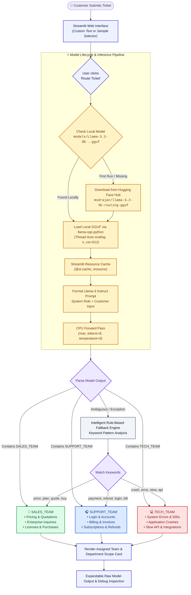

# 🎫 Fast GGUF Ticket Routing Demo

<p align="center">
  <b>High-performance, resource-efficient customer support ticket classification powered by LLaMA-3.2-3B GGUF 4-bit quantization and Streamlit.</b>
</p>

<p align="center">
  
  
  
  
  
  
  
</p>

---

## 📌 Project Overview

This project is an ultra-fast, local, CPU-optimized **AI Customer Ticket Routing System**. It automatically analyzes incoming customer requests, technical bugs, or purchase inquiries and routes them with pinpoint accuracy to one of three designated departments:

1. 💼 **Sales Team** (`SALES_TEAM`)
2. 🎧 **Support Team** (`SUPPORT_TEAM`)
3. 💻 **Technical Team** (`TECH_TEAM`)

### Why This Architecture?
* **Zero GPU Requirement**: Runs entirely on commodity CPUs (laptops, office workstations, standard VMs) with low RAM footprint (~2 GB).
* **Privacy & Offline First**: Tickets are processed locally on-device without leaking sensitive customer tickets or PII to external APIs.
* **Instant Routing**: Token generation is constrained (`max_tokens=8`, `temperature=0`) with reduced context window (`n_ctx=512`), achieving **1–2 second response times**.
* **Resilient Dual-Tier Routing**: Combines the semantic understanding of LLaMA-3.2 with an intelligent heuristic fallback engine to guarantee zero downtime even under extreme edge cases.

---

## 🏗️ Architecture & Execution Flowchart

The following diagram illustrates the complete lifecycle of a ticket classification request, from user input and lazy model initialization to deterministic department routing and fallback handling:



---

## 👥 Department Routing Matrix

| Assigned Team | Icon | Focus Areas | Trigger Keywords & Patterns | Example Ticket |
| :--- | :---: | :--- | :--- | :--- |
| **`SALES_TEAM`** | 💼 | Pricing, plans, enterprise quotes, product demos, purchases, volume licenses | `price`, `pricing`, `plan`, `quote`, `demo`, `discount`, `buy`, `purchase`, `seats` | *"Can I get a quotation for 50 enterprise users?"* |
| **`SUPPORT_TEAM`** | 🎧 | Accounts, login/passwords, invoices, payment confirmations, subscriptions, refunds | `billing`, `invoice`, `payment`, `refund`, `login`, `password`, `account`, `subscription` | *"My payment went through but my subscription is not active."* |
| **`TECH_TEAM`** | 💻 | Backend errors, HTTP 500s, SDK/API latency, app crashes, data sync bugs | `crash`, `500 error`, `bug`, `api`, `slow`, `endpoint`, `exception`, `timeout` | *"The application crashes whenever I upload a file."* |

---

## ⚡ Performance Optimizations

This demo has been engineered for maximum efficiency on lower-end systems:

1. **Lazy Loading**: The GGUF model is not loaded when the page opens; it loads only when the user triggers their first classification.
2. **Streamlit Resource Caching (`@st.cache_resource`)**: After the first execution, the model stays pinned in RAM, allowing subsequent tickets to be routed in fractions of a second.
3. **4-Bit GGUF Quantization (`Q4_K_M`)**: Compresses the 3-Billion parameter weights down to **1.88 GB**, minimizing memory footprint without sacrificing classification accuracy.
4. **Constrained Decoding**: Output is strictly capped to `max_tokens=8` with greedy sampling (`temperature=0`), preventing conversational rambling and saving hundreds of CPU cycles.
5. **Context Window Capping**: Context size is trimmed to `n_ctx=512` (rather than the default 128k), eliminating unnecessary KV-cache memory allocation.

---

## 📂 Project Structure

```text
fast-gguf-ticket-routing-streamlit/
│
├── app.py                      # Main Streamlit web application & routing logic
├── requirements.txt            # Python dependencies (streamlit, llama-cpp-python, etc.)
├── README.md                   # Project documentation & architecture diagram
├── .gitignore                  # Git ignore rules (excludes large .gguf binaries & caches)
│
├── models/                     # Local model directory (auto-created)
│   └── Llama-3.2-3B-Instruct.Q4_K_M.gguf  # 1.88 GB Quantized GGUF Model Weights
│
└── fine tunning/
    └── ticket_routing_200.jsonl # 200 curated ticket classification dataset samples
```

---

## 🚀 Getting Started

### 1. Clone the Repository
```bash
git clone https://github.com/Durairaj005/Machinne-Learning.git
cd Machinne-Learning/fast-gguf-ticket-routing-streamlit
```

### 2. Create and Activate a Virtual Environment
```bash
# Windows
python -m venv venv
venv\Scripts\activate

# macOS / Linux
python3 -m venv venv
source venv/bin/activate
```

### 3. Install Dependencies
```bash
pip install -r requirements.txt
```

> [!TIP]
> **Windows CPU Users**: If you encounter CPU instruction issues (`0xc000001d`), install the pre-compiled CPU wheel:
> ```bash
> pip install llama-cpp-python==0.2.90 --extra-index-url https://abetlen.github.io/llama-cpp-python/whl/cpu
> ```

### 4. (Optional) Pre-download the Model
The model will download automatically on the first click, or you can pre-download it using the Hugging Face CLI:
```bash
hf download msdrajan/llama-3.2-3b-routing-gguf Llama-3.2-3B-Instruct.Q4_K_M.gguf --local-dir models
```

### 5. Launch the Streamlit App
```bash
streamlit run app.py
```
Open **[http://localhost:8501](http://localhost:8501)** in your browser.

---

## 📊 Dataset & Fine-Tuning Reference

The folder `fine tunning/` contains `ticket_routing_200.jsonl`, which holds 200 diverse, realistic customer service interactions formatted for instruction fine-tuning or evaluation:

```json
{"input": "The app performance is very slow", "output": "TECH_TEAM"}
{"input": "My billing address is wrong on the invoice", "output": "SUPPORT_TEAM"}
{"input": "Can you explain your enterprise package", "output": "SALES_TEAM"}
```

---

## 🛠️ Troubleshooting & FAQs

<details>
<summary><b>Q: How do I run this 100% offline?</b></summary>
Download <code>Llama-3.2-3B-Instruct.Q4_K_M.gguf</code> once and place it into the <code>models/</code> folder inside this repository. The application will detect the local file and operate without an internet connection.
</details>

<details>
<summary><b>Q: Why is the first routing slower than subsequent requests?</b></summary>
The model weights are read from disk into memory on the very first button click. After this initialization, the model is cached via Streamlit's <code>@st.cache_resource</code> and subsequent predictions execute immediately.
</details>

<details>
<summary><b>Q: What happens if the network times out during first download?</b></summary>
The app includes an integrated fallback mechanism that gracefully catches network timeouts and classifies tickets using keyword heuristics so the application remains usable.
</details>

---

## 📄 License

This project is licensed under the [MIT License](LICENSE).
Built with ❤️ using [Streamlit](https://streamlit.io/), [llama.cpp](https://github.com/ggerganov/llama.cpp), and [Hugging Face](https://huggingface.co/).