# 📄 Offline RAG-Based AI Document Assistant

A fully offline, privacy-centric, enterprise-grade **Retrieval-Augmented Generation (RAG) Document Intelligence Assistant**. Powered by **Meta's FAISS**, state-of-the-art **BAAI/bge-small-en-v1.5** embeddings, and local open-source LLMs via **Ollama (`llama3.2`)**, running completely on-device with zero external API calls or subscription costs.

---

## 🎯 Objective & Overview

Traditional cloud RAG architectures expose sensitive internal documents, resumes, and corporate PDFs to external third-party APIs. This project implements a **100% offline, local-first document intelligence system** that:
- Ingests single or multi-page PDFs page-by-page with source tracking.
- Segments text into metadata-rich overlapping chunks.
- Computes high-dimensional dense vector embeddings using **`BAAI/bge-small-en-v1.5`**.
- Indexes embeddings using **FAISS (`IndexFlatIP`)** for exact cosine similarity search.
- Classifies incoming questions into intent categories (Skill/Profile extraction, factual lookup, definition, summary, comparison).
- Employs a **hybrid lexical reranker** to boost domain-specific terms (e.g., technical skills, certifications, work experience).
- Feeds retrieved passages into a local **Ollama** LLM (e.g., `llama3.2`, `mistral`, `phi3`) to synthesize grounded, citation-backed answers.
- Displays full evaluation metrics (similarity scores, response times, chunk count, and confidence levels) within a clean, professional, high-contrast dashboard.

---

## 🏗️ Architecture & Execution Flowchart

The following diagram illustrates the complete end-to-end lifecycle of document ingestion, vector indexing, query classification, hybrid retrieval, LLM reasoning, and evaluation metrics:

```mermaid
flowchart TD
    classDef client fill:#EEF2FF,stroke:#4F46E5,stroke-width:2px,color:#1E1B4B;
    classDef process fill:#FEF3C7,stroke:#D97706,stroke-width:2px,color:#78350F;
    classDef decision fill:#EDE9FE,stroke:#7C3AED,stroke-width:2px,color:#4C1D95;
    classDef vector fill:#DCFCE7,stroke:#16A34A,stroke-width:2px,color:#14532D;
    classDef model fill:#DBEAFE,stroke:#2563EB,stroke-width:2px,color:#1E3A8A;
    classDef fallback fill:#F1F5F9,stroke:#64748B,stroke-width:2px,color:#0F172A;
    classDef output fill:#F0FDF4,stroke:#059669,stroke-width:2px,color:#064E3B;

    Start(["👤 User Uploads PDF(s)"]) --> UI["Streamlit Web Interface<br/><i>(Clean Professional Light Theme)</i>"]:::client
    UI --> TriggerIndex{"User clicks<br/>'Process PDFs'"}:::client

    subgraph Ingestion ["📥 Ingestion & Document Processing Pipeline (src/pdf_reader.py & src/text_splitter.py)"]
        TriggerIndex --> ExtractText["PyMuPDF (fitz) Extractor<br/><i>Page-by-page text & layout extraction</i>"]:::process
        ExtractText --> AutoTuner["Auto-Tuner Analysis (src/auto_tuner.py)<br/><i>Volume & word count adaptive settings</i>"]:::process
        AutoTuner --> TextChunker["Sliding Window Text Splitter<br/><i>Word-level chunking with overlap & metadata</i>"]:::process
    end

    subgraph VectorEngine ["🧠 Vector Store & Embedding Pipeline (src/embeddings.py & src/vector_db.py)"]
        TextChunker --> BGEEmbed["BAAI/bge-small-en-v1.5 Embedder<br/><i>Generate 384-dim dense float32 vectors</i>"]:::vector
        BGEEmbed --> FAISSBuild["Build FAISS Vector Index<br/><i>IndexFlatIP (Exact Cosine Similarity)</i>"]:::vector
        FAISSBuild --> DiskStore["Persist Vector Store to Disk<br/>• <code>document_index.faiss</code> (Vectors)<br/>• <code>document_chunks.json</code> (Metadata)"]:::vector
    end

    UserQuery(["❓ User Enters Question"]) --> QueryUI["Question Input Area (app.py)"]:::client
    QueryUI --> Classify["Query Classifier (src/query_classifier.py)<br/><i>Detect Skills, Fact, Summary, Definition</i>"]:::decision

    subgraph Retrieval ["🔍 Query Processing & Hybrid Retrieval (src/rag_pipeline.py)"]
        Classify --> AsymEmbed["Asymmetric Query Embedding<br/><i>Prefix: 'Represent this sentence...'</i>"]:::model
        AsymEmbed --> FAISSSearch["FAISS Top-K Candidate Search<br/><i>Retrieve initial candidate pool (K=5)</i>"]:::vector
        FAISSSearch --> LexicalRerank["Lexical Keyword Reranker<br/><i>Domain synonym boost (skills, work, tools)</i>"]:::process
        LexicalRerank --> ScoreBlend["Score Blending (70% Semantic + 30% Lexical)"]:::process
    end

    ScoreBlend --> GuardCheck{"Top Score &ge; Min Threshold?<br/><i>(Default: &ge; 0.20)</i>"}:::decision

    subgraph Inference ["🤖 Local LLM Inference & Synthesis (src/ollama_llm.py)"]
        GuardCheck -- "Yes (Sufficient Context)" --> PromptFmt["Format Structured Context Prompt<br/><i>System rules + retrieved chunk text</i>"]:::model
        PromptFmt --> OllamaRun["Ollama Local LLM API<br/><code>llama3.2</code> (HTTP POST :11434)"]:::model
        OllamaRun --> GenAnswer["Synthesize Grounded Answer"]:::output
    end

    GuardCheck -- "No (Irrelevant / Weak)" --> FallbackMsg["Guardrail Fallback Response<br/><i>'I could not find this information...'</i>"]:::fallback

    subgraph Presentation ["📊 Evaluation & Presentation Layer (app.py & assets/style.css)"]
        GenAnswer --> RenderCards["Render High-Contrast AI Answer Card"]:::output
        FallbackMsg --> RenderCards
        RenderCards --> MetricCalc["Compute Evaluation Metrics<br/>• Similarity Scores & Average<br/>• End-to-End Latency<br/>• Confidence Level"]:::output
        MetricCalc --> SourceTable["Display Retrieved Chunks & Page References"]:::output
    end
```



---

## 🧭 Component-by-Component Breakdown ("Which Place Which Works")

The table below explains every file, module, and data boundary across the repository:

| File / Module | Component Name | Role & Responsibility | Key Logic & Optimizations |
| :--- | :--- | :--- | :--- |
| [`app.py`](file:///c:/Users/durai9999/OneDrive/Pictures/Desktop/offline-rag-document-assistant/app.py) | **Web Interface & Dashboard** | Main Streamlit user interface, state management, file uploader, and response rendering. | Holds session state (`index`, `chunks`, `embedding_model`), handles sidebar controls, and renders high-contrast metric badges. |
| [`.streamlit/config.toml`](file:///c:/Users/durai9999/OneDrive/Pictures/Desktop/offline-rag-document-assistant/.streamlit/config.toml) | **Native Theme Config** | Forces Streamlit's engine into a clean light theme. | Sets `base = "light"`, `backgroundColor = "#ffffff"`, and deep slate typography (`#0f172a`). |
| [`assets/style.css`](file:///c:/Users/durai9999/OneDrive/Pictures/Desktop/offline-rag-document-assistant/assets/style.css) | **Design System & Aesthetics** | Custom CSS overriding dark colors with a modern, executive-grade white design. | Imports *Plus Jakarta Sans* & *Outfit*, applies crisp borders (`#e2e8f0`), accessible widget labels, and sleek buttons. |
| [`src/pdf_reader.py`](file:///c:/Users/durai9999/OneDrive/Pictures/Desktop/offline-rag-document-assistant/src/pdf_reader.py) | **Document Parser** | Ingests PDF bytes and extracts text page-by-page. | Uses **PyMuPDF (`fitz`)** for high-speed local PDF parsing without requiring poppler or OCR binaries. |
| [`src/text_splitter.py`](file:///c:/Users/durai9999/OneDrive/Pictures/Desktop/offline-rag-document-assistant/src/text_splitter.py) | **Sliding Window Chunking** | Breaks page text into overlapping chunks with metadata. | Generates chunk dictionaries with `file_name`, `page_number`, `chunk_id`, and `chunk_text` for provenance tracking. |
| [`src/embeddings.py`](file:///c:/Users/durai9999/OneDrive/Pictures/Desktop/offline-rag-document-assistant/src/embeddings.py) | **Dense Vector Embedder** | Converts text and queries into 384-dimensional vector representations. | Defaults to **`BAAI/bge-small-en-v1.5`**. Applies asymmetric query formatting (`Represent this sentence...`) for high retrieval recall. |
| [`src/vector_db.py`](file:///c:/Users/durai9999/OneDrive/Pictures/Desktop/offline-rag-document-assistant/src/vector_db.py) | **FAISS Index & Store** | High-performance vector database storage and exact cosine search. | Implements **`faiss.IndexFlatIP`** with L2-normalized float32 vectors. Separates raw vectors (`.faiss`) from metadata (`.json`). |
| [`src/query_classifier.py`](file:///c:/Users/durai9999/OneDrive/Pictures/Desktop/offline-rag-document-assistant/src/query_classifier.py) | **Query Intent Classifier** | Identifies the nature of user questions. | Distinguishes between *Extraction / Skills*, *Definition*, *Summary*, *Comparison*, and *Direct Fact* questions. |
| [`src/auto_tuner.py`](file:///c:/Users/durai9999/OneDrive/Pictures/Desktop/offline-rag-document-assistant/src/auto_tuner.py) | **Parameter Auto-Tuner** | Dynamically recommends chunk size, overlap, Top-K, and similarity thresholds. | Automatically adjusts settings based on document length and question complexity to prevent context starvation. |
| [`src/rag_pipeline.py`](file:///c:/Users/durai9999/OneDrive/Pictures/Desktop/offline-rag-document-assistant/src/rag_pipeline.py) | **Pipeline Orchestrator** | Coordinates vector retrieval, reranking, threshold evaluation, and confidence scoring. | Combines semantic similarity (70%) with lexical keyword expansion (30%), preventing resume extraction false negatives. |
| [`src/ollama_llm.py`](file:///c:/Users/durai9999/OneDrive/Pictures/Desktop/offline-rag-document-assistant/src/ollama_llm.py) | **Local LLM Client** | Formats strict prompt context and communicates with Ollama. | Calls `http://localhost:11434/api/generate` with zero data leakage, instructing `llama3.2` to answer strictly from context. |

---

## ⚡ Performance Optimizations & Embedding Benchmark

### 1. The Embedding Upgrade: `all-MiniLM-L6-v2` vs `BAAI/bge-small-en-v1.5`
In domain-specific documents (such as technical resumes where skills appear as comma-separated terms like `SQL, Python, Machine Learning`), conversational questions (*"what is my skills"*) often produce low semantic similarity under generic models:

| Test Query | Chunk Content | `all-MiniLM-L6-v2` Score | `BAAI/bge-small-en-v1.5` Score | Result Impact |
| :--- | :--- | :---: | :---: | :--- |
| *"what is my skills"* | `SQL, Python, Data Engineering, ML, Web Development...` | `0.244` (Rejected by guardrail) | **`0.624` (High Confidence)** | **+155% improvement; correctly extracted** |
| *"who is the author"* | `DURAIRAJAN G - Data Analyst Aspiring...` | `0.382` | **`0.589`** | Instant author grounding |

### 2. FAISS Exact Retrieval (`IndexFlatIP`)
Unlike approximate nearest neighbor (ANN) indexes like HNSW which trade accuracy for speed, FAISS `IndexFlatIP` calculates exact inner product over normalized vectors. This yields **100% recall** at sub-millisecond latencies for document stores.

### 3. Hybrid Lexical Reranker
A lightweight hybrid scoring layer boosts relevant passages containing domain keywords (`skills`, `technologies`, `tools`, `experience`, `projects`), ensuring list-style sections rank at the top before hitting the LLM.

---

## 📈 Evaluation Metrics Explained

When an answer is generated, the assistant presents six real-time evaluation metrics:

1. **Total PDFs Uploaded**: Number of distinct documents active in the searchable session.
2. **Total Text Chunks**: Total segments stored in the FAISS vector index.
3. **Top Similarity Scores**: Cosine similarity values for the top retrieved candidate chunks (range: `0.000` to `1.000`).
4. **Average Similarity Score**: Mean cosine similarity across the retrieved Top-K chunks.
5. **Response Time**: Total round-trip latency (vector embedding + FAISS search + Ollama LLM generation).
6. **Confidence Level**:
   - 🟢 **High Confidence**: Top score &ge; `0.50`
   - 🟡 **Medium Confidence**: Top score &ge; `0.35`
   - 🟠 **Low Confidence**: Top score &ge; `0.20`
   - 🔴 **Answer Not Found**: Top score < `0.20` or guardrail triggered

---

## 🛠️ Installation & Setup

### 1. Clone the Repository
```bash
git clone https://github.com/Durairaj005/Machinne-Learning.git
cd Machinne-Learning/offline-rag-document-assistant
```

### 2. Create and Activate Virtual Environment
```powershell
python -m venv .venv
.\.venv\Scripts\Activate.ps1
```

### 3. Install Dependencies
```bash
pip install -r requirements.txt
```

### 4. Install & Launch Ollama
1. Download Ollama from [ollama.com/download](https://ollama.com/download).
2. Start the Ollama background service.
3. Pull your preferred local model:
```bash
ollama pull llama3.2
```

### 5. Launch the Streamlit Application
```bash
python -m streamlit run app.py
```
Open your browser to `http://localhost:8501` (or the port specified in terminal).

---

## 📂 Project Directory Structure

```text
offline-rag-document-assistant/
│
├── .streamlit/
│   └── config.toml             # Native Streamlit light theme configuration
│
├── assets/
│   └── style.css               # Clean, high-contrast professional CSS theme
│
├── src/
│   ├── __init__.py
│   ├── auto_tuner.py           # Dynamic chunking and retrieval threshold tuning
│   ├── embeddings.py           # BAAI/bge-small-en-v1.5 embedding generator
│   ├── ollama_llm.py           # Local Ollama LLM client & prompt engine
│   ├── pdf_reader.py           # PyMuPDF page-by-page text extractor
│   ├── query_classifier.py     # Intent classification (Skills, Facts, Summary)
│   ├── rag_pipeline.py         # End-to-end RAG orchestrator & lexical reranker
│   ├── text_splitter.py        # Sliding window text chunking with metadata
│   └── vector_db.py            # FAISS vector database helpers & JSON serializer
│
├── vector_store/
│   ├── document_index.faiss    # Serialized FAISS float32 vector index
│   └── document_chunks.json    # JSON chunk metadata and text lookup table
│
├── app.py                      # Main interactive Streamlit application
├── requirements.txt            # Dependency specification
├── test_rag.py                 # Automated pipeline verification script
├── run.bat                     # Windows quick-launch batch script
└── README.md                   # System documentation & architecture flowchart
```

---

## 🔒 Privacy & Offline Guarantee
This application does **not** send telemetry, prompts, documents, or vector embeddings over the internet. All weights (`bge-small-en-v1.5` and `llama3.2`) run strictly on local CPU/GPU hardware.
